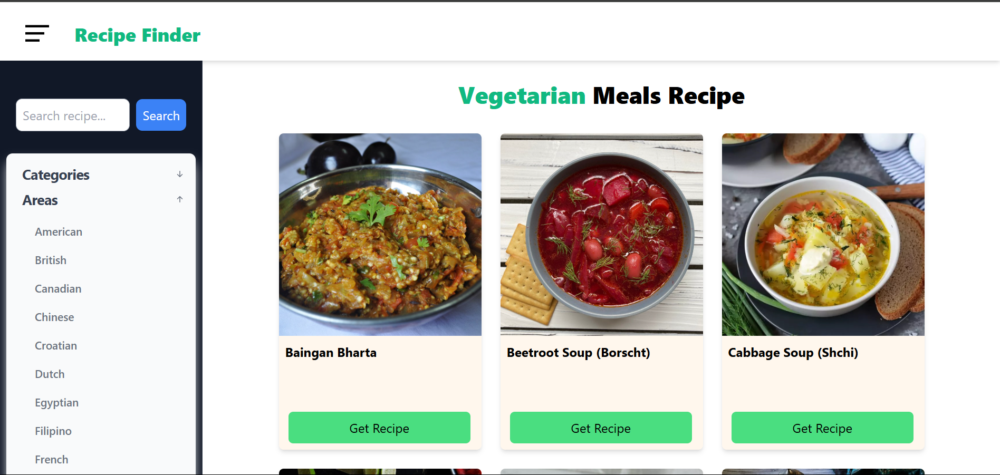
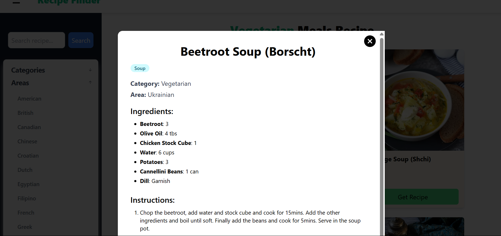
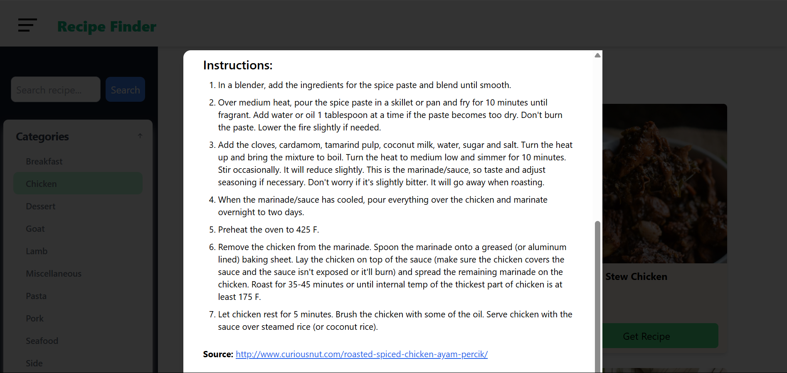

# 🍽️ Recipe Finder

A React-based web application that displays delicious recipes using [TheMealDB API](https://www.themealdb.com/). Users can explore recipes by category or area, and view detailed information in a modal interface.

## 🌐 Live

[Live link - recipe-finder-mealdb.netlify.app](https://recipe-finder-mealdb.netlify.app/)


## 📸 Preview







## 🔍 Features

-   Browse meals by **category** and **area**
-   View detailed **recipe info** in a modal:
    -   Ingredients
    -   Instructions
    -   Tags
    -   Category
    -   Source
    -   Area
-   Caches data using **localStorage** to reduce API requests and avoid rate limits

## 🧠 How It Works

-   On initial load, **categories** and **areas** are fetched from TheMealDB API and stored in `localStorage`
-   When a user clicks **"View Recipe"** on a card, the full recipe is fetched (if not already cached), stored, and displayed in a modal
-   **Recipe details** include everything from ingredients and instructions to tags and source URL
-   Subsequent visits reuse cached data to minimize API usage and provide faster load times

## 🛠️ Tech Stack

-   ⚡ [Vite](https://vitejs.dev/) — lightning-fast frontend build tool
-   ⚛️ [React](https://reactjs.org/) — component-based JavaScript library
-   📦 [Axios](https://axios-http.com/) — promise-based HTTP client for API requests
-   🔁 React's `createContext` — for shared state management
-   🌐 `localStorage` — browser-side caching of category, area, and recipe data

## 📦 Getting Started

### 1. Clone the repository

```bash
git clone https://github.com/your-username/your-repo-name.git
cd your-repo-name
```
